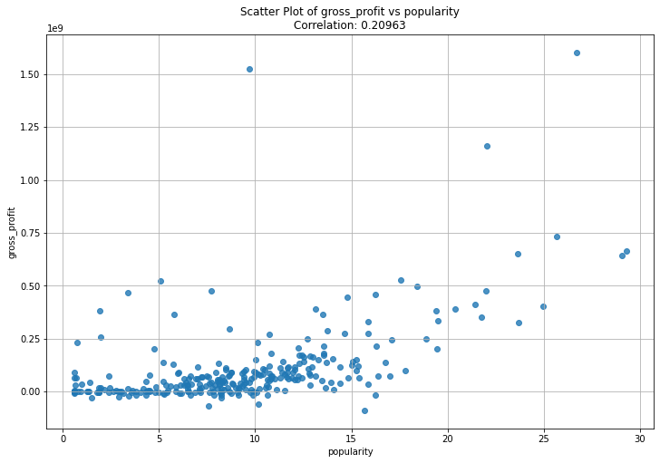

Analysis of Box Office trends for Microsoft Movie Studio

Image from [theNumber](https://www.the-numbers.com/news/256930830-Theater-counts-IF-narrowly-tops-Garfield-to-become-widest-release-on-its-second-weekend-in-theaters)

Overview
My aim is to gain insights for Microsoft Movie studio by exploring Box office trends.I will do so by analysing genre performance,top grossing films and finding the correlation between rating and film popularity

Business Understanding
Microsoft wants to set up a Movie Studio and they lack experience in the film industry.
I have therefore been  tasked with exploring box office data to identify the most strategic films the company can invest in.
I decided to break down the main objective into specific objectives to help me achieve my goal such as:

1.To identify the most strategic movie genres to produce based on the data analysed.

2.To determine the top grossing films that the company can invest in by analysing the production cost to effectively maximise on the profits.

3.To identify our target audience that drive box office success so that Microsoft can tailor content that resonates with the audience.

4.To also find the correlation between rating and film popularity to determine whether higher ratings tends to be associated with higher popularity or vice versa

Plotting our findings on most Popular genre

Movie genres thats fall under more than one category are more popular and more profitable too.

Checking the top grossing film genre

Finding the  correlation between rating and popularity

From the figure above its evident  that there is a weak positive correlation between average rating and popularity meaning higher ratings tend to be associated with higher popularity.

Finding the  correlation between gross profit and popularity

I can say that there is a weak positive correlation between gross profit and popularity.Meaning the profitability of a movie does not solely rely on how popular it is.However factors like marketing hype and repeat viewings would come in handy.

Conclusion
From the analysis conducted above,I can say that:

1.Movie genres thats fall under more than one category are more popular and more profitable too.

2.There is a positive correlation between average rating of a film and its popularity.However its a weak positive correlation.This means that there's a slight tendency for movies with higher average ratings to also be more popular.This means that there are many other factors that can affect popularity of a film other than its ratings.Such factors include availability and distribution and movie genre.

3.Popularity of a film does not necessarily make the film profitable,however other factors such as marketing hype and repeat viewings are likely to increase the profitability.

Recommendation
1.  Microsoft should focus on producing movie genres that fall under more that one category as they are more popular and more profitable too such as comedy drama reality genre and famil fantasy musical genres.

2.  There is a slight positive correlation between popularity  and film profitability.To maximise on the profits ,Microsoft needs to increase popularity by hyping marketing and increasing repeat viewings.This however does not automatically lead to high profits.

3.  While there's a slight positive correlation between average rating and popularity, it's important to consider the limitations and other influencing factors such as target audience and mode of distribution. A high average rating is just one piece of the puzzle when it comes to predicting a movie's popularity.